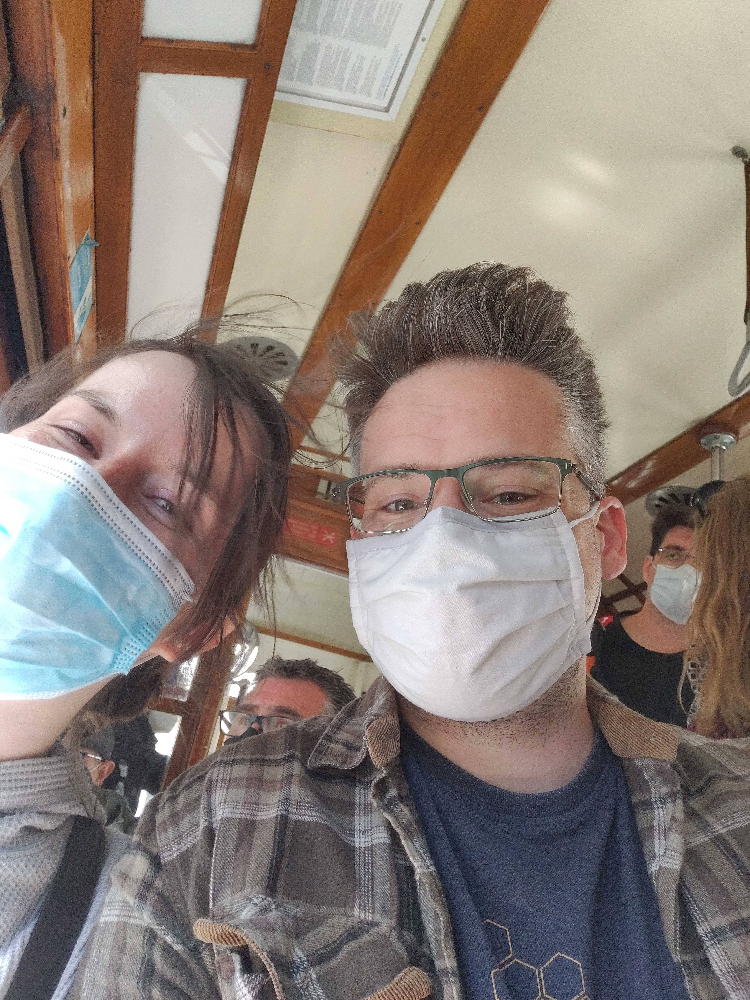
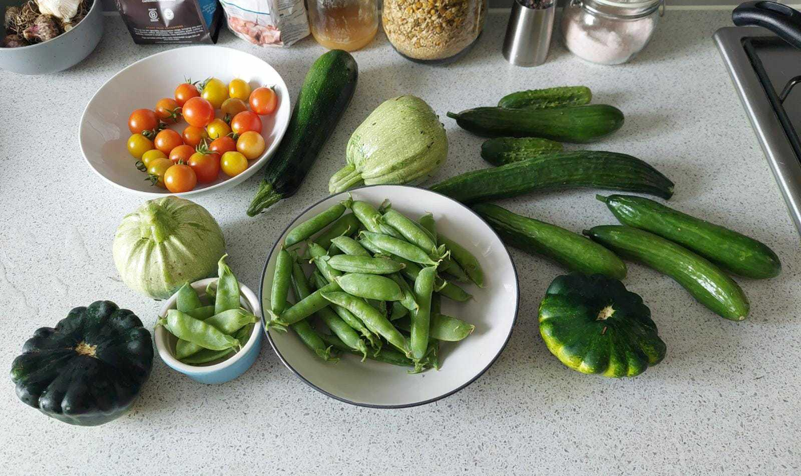
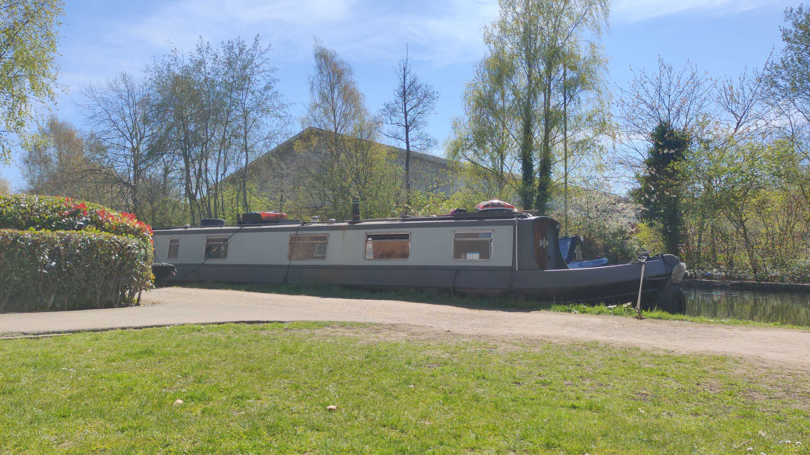

# <!--fit--> Hi There 👋

https://curious-arithmetic-eeee7f.netlify.app

<!-- This is presenter note. You can write down notes through HTML comment. -->

---

## <!--fit--> **Professional Background**

* **Two years @ AstraZeneca**
    Tech Lead on R&D High Performance Computing Team
    Lots of modernisation work on a legacy platform

* **Four Years @ University of Cambridge**
    Mostly working on scientific computing and High Performance Computing
    Largest Academic Supercomputer in UK and fastest parallel storage system in the world

---

## <!--fit--> **Professional Background**

* **Stem Cell Institute**, where I got into HPC
* Managed several IT departments, worked in a few schools
* Worked in the building supplies trade for a while
* Cocktail Bars when I was ~~much~~ younger
* Wanted to work with Geographical Information Systems
---

## <!--fit--> **Un/Professional Background**

* Refitting a narrow boat
* Loves the outdoors, often found cycling
* Loves food and gardening
* Bit of a biophile

___

## <!--fit--> **My Obsession with Computers**

* Been into Computers, especially Open Source & Linux since childhood
* I like solving problems **with** computers
* Read `the phoenix project` in 2014...
* EVERYTHING IS CODE (even these slides...)

---

### :ok_hand:

> #home-automation #homelabbing #3d-printing
> #esp-home #raspberry-pi 

> #TDD #hug-ops #git-ops #cloud-native
> #automate-everything

---

<!-- _backgroundColor: "#123" -->
<!-- _color: "#fff" -->

##### <!--fit--> 🧊 Stay cool in the heat!

---

### Grab me for coffee ([@mark.sharpley](https://github.com/markopolo123))
